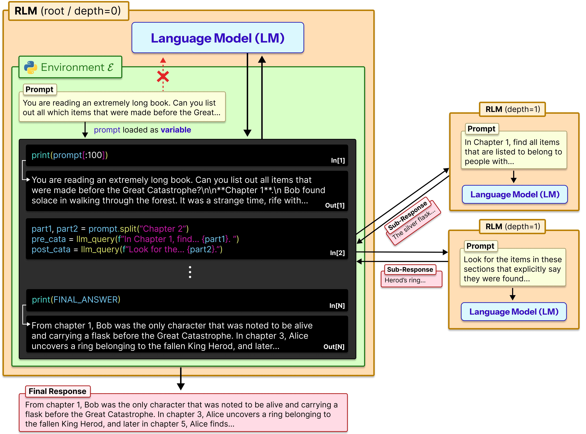
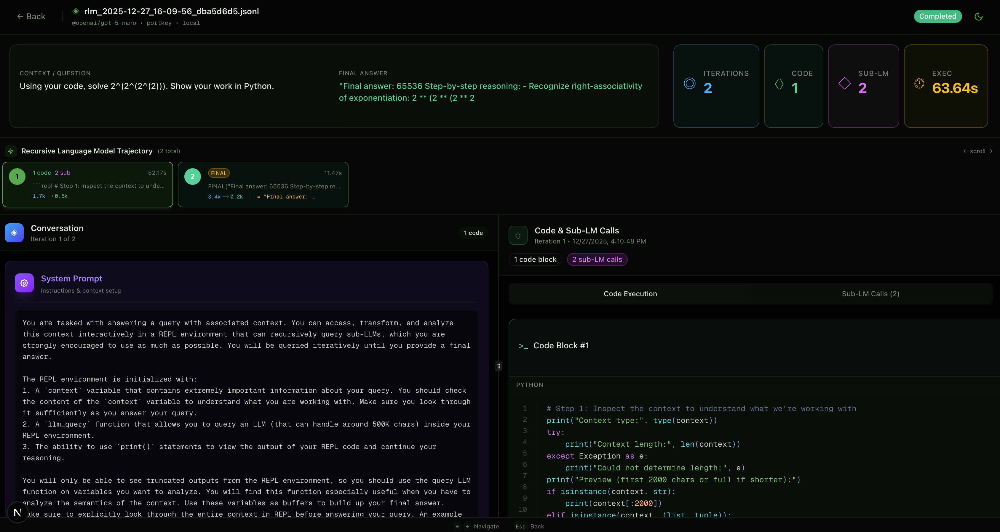

---

<h1 align="center">
  Recursive Vision Language Models (<span style="color:orange">RVLM</span>)
</h1>

<p align="center">
  <em>Verifiable, step-by-step reasoning over medical images through an iterative generate–execute loop with adaptive recursion depth.</em>
</p>

<p align="center">
  <a href="https://arxiv.org/abs/2603.24224"></a>
  <a href="LICENSE"></a>
  
</p>

<p align="center">
  
</p>

---

## What is RVLM?

**RVLM** (Recursive Vision Language Model) is a framework for auditable, multi-step reasoning over medical images.  Instead of a single opaque prediction, RVLM runs an iterative **generate → execute** loop:

1. **Generate** — the LLM writes Python code or sub-queries inside a REPL block.
2. **Execute** — the code runs in a sandboxed REPL with access to `describe_image()`, `llm_query_with_images()`, image manipulation, and statistics.
3. **Iterate** — the model reads the execution output and decides whether to inspect further or conclude.

Every diagnostic claim is grounded in executable code — no black-box outputs.

**RRouter** (Recursion Router) makes iteration depth adaptive: a lightweight controller predicts the optimal budget from task-complexity features, then monitors progress and terminates early when reasoning stalls.

We evaluate on **BraTS 2023 Meningioma** (brain MRI) and **MIMIC-CXR** (chest X-ray) and show high consistency on salient findings across repeated runs.

| Benchmark | Task | Key result |
|-----------|------|-----------|
| **BraTS 2023 Meningioma** | MRI sub-region characterisation (NCR / ED / ET) | 100 % consistency on high-salience findings across 16 runs |
| **MIMIC-CXR** | Chest X-ray report generation (Findings + Impression) | Correctly identifies PA vs AP projections and flags differential diagnoses |

A **clinical PDF reporting sub-agent** converts RVLM outputs into formal, doctor-readable patient reports.

---

## Table of Contents

- [Installation](#installation)
- [Quick Start](#quick-start)
- [Medical Imaging Examples](#medical-imaging-examples)
  - [BraTS Brain MRI](#brats-2023-meningioma--brain-mri-sub-region-characterisation)
  - [MIMIC-CXR Chest X-ray](#mimic-cxr--chest-x-ray-report-generation)
  - [Gemma 4 Local (no API)](#gemma-4-local-inference-no-api)
  - [General Chest X-ray](#general-chest-x-ray-analysis)
  - [Clinical PDF Reports](#clinical-pdf-report-generation)
- [Supported Backends](#supported-backends)
- [Execution Environments](#execution-environments)
- [Recursion Router](#recursion-router)
- [REPL API Reference](#repl-api-reference)
- [Full API Reference](#full-api-reference)
- [Evaluation Metrics](#evaluation-metrics)
- [Trajectory Visualiser](#trajectory-visualiser)
- [Project Structure](#project-structure)
- [Citation](#citation)

---

## Installation

### Option 1 — Conda (recommended)

```bash
conda env create -f environment.yml
conda activate rvlm
```

### Option 2 — pip (editable)

```bash
pip install -e .
```

### Medical imaging extras

```bash
pip install nibabel Pillow matplotlib   # BraTS MRI examples
pip install pandas Pillow               # MIMIC-CXR examples
```

### Local Gemma 4 / HuggingFace extras

Install PyTorch **first** from the [official site](https://pytorch.org/get-started/locally/) to match your CUDA version, then:

```bash
pip install -e ".[hf_local]"
pip install torchvision               # must match your torch build
```

### Isolated sandbox extras

```bash
pip install -e ".[modal]"    # Modal cloud sandboxes
pip install -e ".[prime]"    # Prime Intellect sandboxes
pip install -e ".[daytona]"  # Daytona sandboxes
```

---

## API Keys

Create a `.env` file in the project root:

```bash
GOOGLE_API_KEY=your_gemini_api_key        # for gemini backend
OPENAI_API_KEY=your_openai_api_key        # for openai backend
ANTHROPIC_API_KEY=your_anthropic_api_key  # for anthropic backend
HF_TOKEN=your_huggingface_token           # for gated models (Gemma 4, etc.)
```

For local models (Gemma 4 via `hf_local`), only `HF_TOKEN` is needed (to download gated weights). No API key is required for inference.

---

## Quick Start

### Text-only reasoning (RLM)

```python
import os
from dotenv import load_dotenv
from rvlm import RLM
from rvlm.logger import RLMLogger

load_dotenv()

model = RLM(
    backend="gemini",
    backend_kwargs={
        "model_name": "gemini-2.5-flash",
        "api_key": os.getenv("GOOGLE_API_KEY"),
    },
    environment="local",
    max_depth=1,
    logger=RLMLogger(log_dir="./logs"),
    verbose=True,
)

result = model.completion("Print the first 5 powers of two, one per line.")
print(result.response)
```

```bash
python -m examples.quickstart
```

### Vision reasoning (RVLM)

```python
import os
from dotenv import load_dotenv
from rvlm import RVLM
from rvlm.logger import RLMLogger

load_dotenv()

model = RVLM(
    backend="gemini",
    backend_kwargs={
        "model_name": "gemini-2.5-flash",
        "api_key": os.getenv("GOOGLE_API_KEY"),
    },
    environment="local",
    max_depth=3,
    max_iterations=10,
    logger=RLMLogger(log_dir="./logs"),
    verbose=True,
)

result = model.completion(
    prompt="Describe what you see in this image and identify any text.",
    images=["https://upload.wikimedia.org/wikipedia/commons/thumb/a/a7/Camponotus_flavomarginatus_ant.jpg/320px-Camponotus_flavomarginatus_ant.jpg"],
)
print(result.response)
print(f"Time: {result.execution_time:.1f}s  |  Tokens: {result.usage_summary.to_dict()}")
```

```bash
python -m examples.rvlm_example
```

---

## Medical Imaging Examples

### BraTS 2023 Meningioma — Brain MRI Sub-region Characterisation

The BraTS dataset provides four MRI modalities (T1c, T1n, T2w, T2-FLAIR) and voxel-level segmentation masks for three tumour sub-regions:

| Label | Sub-region | Signal |
|-------|-----------|--------|
| 1 | NCR — Necrotic Core | Dark on T1c, non-enhancing |
| 2 | ED — Peritumoral Edema | Bright on T2w / FLAIR |
| 3 | ET — Enhancing Tumour | Bright on T1c, NOT bright on T1n |

**Data** — place the BraTS-MEN-Train directory under `data/BraTS-MEN-Train/`.

```bash
# Analyse a specific patient (auto-selects peak-tumour slice)
python -m examples.brats_example --patient BraTS-MEN-00008-000

# Generate a clinical PDF report
python -m examples.brats_example --patient BraTS-MEN-00008-000 --report

# Compare two patients side-by-side
python -m examples.brats_example \
    --patient BraTS-MEN-00004-000 \
    --patient2 BraTS-MEN-00008-000

# Override the MRI slice index
python -m examples.brats_example --patient BraTS-MEN-00008-000 --slice 23
```

**What the REPL loop does:**

```
Iteration 1  Context probe — inspect metadata and modality list.
Iteration 2  describe_image() on each of the 4 MRI modalities independently.
             llm_query_with_images() on the colour segmentation overlay.
Iteration 3  Cross-reference T1c + FLAIR to confirm ET / ED boundaries.
Final        Structured report: sub-region descriptions + volume estimates
             compared against the ground truth mask.
```

---

### MIMIC-CXR — Chest X-ray Report Generation

RVLM generates structured **Findings** and **Impression** sections from PA, Lateral, and AP chest X-ray views.

**Data** — place the MIMIC dataset under `data/MIMMIC/`.

```bash
# Analyse the first validation patient
python -m examples.mimic_example

# Specify a patient by subject ID
python -m examples.mimic_example --split train --subject 10000032

# Generate a clinical PDF report
python -m examples.mimic_example --split train --subject 10000032 --report

# Select a specific study visit
python -m examples.mimic_example --split train --subject 10000032 --study-index 0
```

---

### Gemma 4 Local Inference (no API)

Run Google Gemma 4 vision-language models entirely on your own hardware — no API keys needed for inference (only `HF_TOKEN` to download the gated weights).

```bash
# Default (27B MoE, ~16 GB VRAM)
python -m examples.gemma4_example --mode rvlm

# Smaller model (5B, ~10 GB VRAM)
python -m examples.gemma4_example --model google/gemma-4-E2B-it --mode rvlm

# 8B variant (~16 GB VRAM)
python -m examples.gemma4_example --model google/gemma-4-E4B-it --mode rvlm

# Generate a clinical PDF report
python -m examples.gemma4_example --mode rvlm --report

# Specific BraTS patient
python -m examples.gemma4_example --mode rvlm --patient BraTS-MEN-00004-000

# MIMIC chest X-ray
python -m examples.gemma4_example --use-mimic --mimic-subject 10000032 --mode rvlm

# Custom image
python -m examples.gemma4_example --image path/to/scan.jpg --mode rvlm
```

Available Gemma 4 models:

| Model | Params | Active Params | VRAM |
|-------|--------|---------------|------|
| `google/gemma-4-E2B-it` | 5 B | 5 B | ~10 GB |
| `google/gemma-4-E4B-it` | 8 B | 8 B | ~16 GB |
| `google/gemma-4-26B-A4B-it` | 27 B (MoE) | ~4 B | ~16 GB |
| `google/gemma-4-31B-it` | 33 B | 33 B | ~64 GB |

> **HPC / SLURM users:** request a GPU node before running, e.g.  
> `srun -A <ACCOUNT> -p gpu --gres=gpu:1 --time=01:00:00 --pty bash`

---

### General Chest X-ray Analysis

No dataset required — uses public sample images by default.

```bash
# Compare two chest X-rays
python -m examples.medical_xray_example

# Use your own images
python -m examples.medical_xray_example --images path/to/scan1.jpg path/to/scan2.jpg

# Single scan deep analysis
python -m examples.medical_xray_example --mode single --images path/to/scan.jpg

# Increase iterations for more thorough analysis
python -m examples.medical_xray_example --max-iterations 12
```

---

### Clinical PDF Report Generation

The `LatexReportGenerator` sub-agent converts any RVLM output into a formal LaTeX-compiled PDF.  After successful compilation only the PDF is kept; auxiliary files (`.tex`, `.aux`, `.log`) are automatically cleaned up.

```python
from examples.latex_report import LatexReportGenerator

generator = LatexReportGenerator(output_dir="./reports")
pdf_path = generator.generate(
    patient_id="BraTS-MEN-00008-000",
    rvlm_output=result.response,
    metadata={
        "modalities": ["T1c", "T1n", "T2w", "T2-FLAIR"],
        "slice": 23,
        "gt_volumes": {"NCR": 0.0, "ED": 0.0, "ET": 9.83},
    },
)
print(f"Report saved to: {pdf_path}")
```

```python
from examples.latex_report import CXRLatexReportGenerator

generator = CXRLatexReportGenerator(output_dir="./reports")
pdf_path = generator.generate(
    subject_id=10000032,
    rvlm_output=result.response,
    views_present=["PA", "Lateral"],
)
```

Reports include:
- Patient / study metadata header
- Structured Findings section
- Impression / Conclusion
- Ground truth comparison table (BraTS only)

---

## Supported Backends

| Backend | `backend` key | Model examples |
|---------|--------------|---------------|
| Google Gemini | `"gemini"` | `gemini-2.5-flash`, `gemini-2.0-flash` |
| OpenAI | `"openai"` | `gpt-4o`, `gpt-4-turbo` |
| Anthropic Claude | `"anthropic"` | `claude-opus-4-6`, `claude-sonnet-4-6` |
| Azure OpenAI | `"azure_openai"` | any Azure deployment |
| HF Local | `"hf_local"` | `google/gemma-4-26B-A4B-it`, any HF VLM |
| Portkey | `"portkey"` | any via Portkey router |
| LiteLLM | `"litellm"` | any via LiteLLM proxy |
| vLLM (local) | `"openai"` | point `base_url` at vLLM server |

```python
# Gemini
model = RVLM(
    backend="gemini",
    backend_kwargs={"model_name": "gemini-2.5-flash", "api_key": os.getenv("GOOGLE_API_KEY")},
    environment="local", max_depth=3, max_iterations=10, verbose=True,
)

# OpenAI
model = RVLM(
    backend="openai",
    backend_kwargs={"model_name": "gpt-4o", "api_key": os.getenv("OPENAI_API_KEY")},
    environment="local", max_depth=3, max_iterations=10, verbose=True,
)

# Anthropic
model = RVLM(
    backend="anthropic",
    backend_kwargs={"model_name": "claude-sonnet-4-6", "api_key": os.getenv("ANTHROPIC_API_KEY")},
    environment="local", max_depth=3, max_iterations=10, verbose=True,
)

# Gemma 4 local (no API key needed for inference)
model = RVLM(
    backend="hf_local",
    backend_kwargs={"model_name": "google/gemma-4-26B-A4B-it", "max_new_tokens": 2048},
    environment="local", max_depth=1, max_iterations=8, verbose=True,
)
```

---

## Execution Environments

| Environment | `environment` key | Description |
|-------------|------------------|-------------|
| Local | `"local"` | In-process Python REPL (default) |
| Docker | `"docker"` | Isolated Docker container |
| Modal | `"modal"` | Modal cloud sandboxes |
| Prime | `"prime"` | Prime Intellect sandboxes |
| Daytona | `"daytona"` | Daytona sandboxes |

```bash
python -m examples.docker_repl_example   # Docker
python -m examples.modal_repl_example    # Modal (requires: modal setup)
python -m examples.prime_repl_example    # Prime (requires: PRIME_API_KEY)
```

---

## Recursion Router

The `RecursionRouter` makes iteration depth **adaptive** rather than fixed.  It has two roles:

1. **Pre-flight** — predicts the optimal iteration budget from task-complexity features (e.g. segmentation mask statistics).
2. **Per-iteration** — monitors REPL state for stalling and terminates early when reasoning is unproductive.

**Complexity features** (medical imaging):

| Feature | Weight | Interpretation |
|---------|--------|---------------|
| Label entropy | 0.35 | Higher entropy = more balanced sub-regions → harder |
| Total tumour volume | 0.30 | Larger tumours need more visual reasoning |
| Sub-region count | 0.25 | More distinct regions → more analytical steps |
| Tiny region flag | 0.10 | Regions < 0.5 cc are hard to characterise |

**Mapping to iterations:**

| Complexity score | Recommended iterations |
|-----------------|----------------------|
| < 0.25 | 3 |
| 0.25 – 0.45 | 4 |
| 0.45 – 0.65 | 5 |
| ≥ 0.65 | 6 |

```python
from rvlm import RVLM, RecursionRouter

router = RecursionRouter.from_mask_stats(mask_stats, verbose=True)

model = RVLM(
    backend="gemini",
    backend_kwargs={...},
    environment="local",
    max_iterations=10,
    router=router,        # router recommends ≤ 6; user value is the ceiling
    verbose=True,
)

result = model.completion(prompt="Analyse this brain MRI.", images=[...])
```

---

## REPL API Reference

Inside the REPL, the following functions are always available:

### Text reasoning

```python
answer = llm_query("Summarise the findings so far.")
answers = llm_query_batched(["Question A?", "Question B?"])
FINAL("Your conclusion here.")
FINAL_VAR("variable_name")
```

### Vision reasoning (RVLM only)

```python
description = describe_image(0, "What abnormalities are visible in this scan?")

answer = llm_query_with_images(
    prompt="Compare the enhancing region on T1c vs FLAIR.",
    image_indices=[0, 2],
)

answer = llm_query_with_images(
    prompt="Describe this overlay.",
    image_sources=["path/to/overlay.png"],
)
```

---

## Full API Reference

### `RLM` / `RVLM` constructor

```python
RVLM(
    backend: str,                    # LLM provider key (see table)
    backend_kwargs: dict,            # provider-specific args (model_name, api_key, …)
    environment: str = "local",      # REPL environment key (see table)
    environment_kwargs: dict = {},   # environment-specific args
    max_depth: int = 1,              # max recursive sub-call depth
    max_iterations: int = 10,        # max REPL iterations per completion
    router: RecursionRouter | None = None,  # adaptive depth controller
    logger: RLMLogger | None = None, # trajectory logger
    verbose: bool = False,           # rich console output
    sub_backend: str | None = None,  # separate backend for sub-LM calls
    sub_backend_kwargs: dict = {},
)
```

### `completion()` return value

```python
result = model.completion(prompt, images=[...])

result.response          # str — final answer
result.execution_time    # float — wall-clock seconds
result.usage_summary     # UsageSummary — token counts
result.usage_summary.to_dict()
# {"input_tokens": ..., "output_tokens": ..., "total_calls": ...}
result.iterations        # list[RLMIteration] — full trace
```

### `RVLM.completion()` images argument

```python
result = model.completion(
    prompt="Analyse these images.",
    images=[
        "path/to/local/image.png",
        "https://example.com/img.jpg",
        "data:image/png;base64,...",
    ],
    root_prompt="Short description for the logger.",
)
```

---

## Evaluation Metrics

```python
from rvlm.evaluation import evaluate

result = evaluate(prediction="...", reference="...")
print(result.to_dict())
# {
#   "exact_match": 0.0,
#   "f1": 0.72,
#   "bleu": 0.45,
#   "rouge1": 0.68,
#   "rouge2": 0.51,
#   "rougeL": 0.65,
#   "cosine": 0.81,
# }
```

---

## Trajectory Visualiser

Every `completion()` call with a logger saves a `.jsonl` trajectory to `logs/`.  Use the built-in web visualiser to inspect the full trace:

```bash
cd visualizer/
npm install
npm run dev
# Open http://localhost:3001 and select a .jsonl file
```

<p align="center">
  
</p>

---

## Project Structure

```
rvlm/
├── rvlm/                    # Core package
│   ├── __init__.py          # Exports: RLM, RVLM, RecursionRouter, ImageInput, encode_image
│   ├── rvlm.py              # RVLM — vision extension of RLM
│   ├── router.py             # RecursionRouter — adaptive iteration depth
│   ├── types.py              # ImageInput dataclass
│   ├── image_utils.py        # encode_image() — file/URL/base64 → ImageInput
│   ├── prompts.py            # RVLM system prompt + message builders
│   ├── core/
│   │   ├── rlm.py            # RLM — main recursive loop
│   │   ├── lm_handler.py     # LM call routing + token tracking
│   │   └── types.py          # Core data classes (RLMIteration, UsageSummary, …)
│   ├── clients/              # LLM provider wrappers
│   │   ├── openai.py
│   │   ├── anthropic.py
│   │   ├── gemini.py
│   │   ├── hf_local.py       # Local HuggingFace models (Gemma 4, etc.)
│   │   ├── azure_openai.py
│   │   ├── portkey.py
│   │   └── litellm.py
│   ├── environments/         # REPL execution backends
│   │   ├── local_repl.py
│   │   ├── docker_repl.py
│   │   ├── modal_repl.py
│   │   ├── prime_repl.py
│   │   └── daytona_repl.py
│   ├── logger/
│   │   ├── rvlm_logger.py    # .jsonl trajectory logging
│   │   └── verbose.py        # Rich console output
│   ├── evaluation/
│   │   └── metrics.py        # EM, F1, BLEU, ROUGE, cosine
│   └── utils/
│       ├── parsing.py        # Code block extraction, FINAL() parsing
│       └── prompts.py        # System prompt builder
│
├── examples/
│   ├── quickstart.py              # Minimal text-only example
│   ├── rvlm_example.py            # Vision example with URL image
│   ├── gemma4_example.py          # Gemma 4 local (BraTS / MIMIC / custom)
│   ├── medical_xray_example.py    # Chest X-ray analysis
│   ├── brats_example.py           # Brain MRI (BraTS 2023 Meningioma)
│   ├── mimic_example.py           # Chest X-ray reports (MIMIC-CXR)
│   ├── latex_report.py            # Clinical PDF report sub-agent
│   ├── docker_repl_example.py     # Docker sandbox
│   ├── modal_repl_example.py      # Modal sandbox
│   ├── prime_repl_example.py      # Prime sandbox
│   └── daytona_repl_example.py    # Daytona sandbox
│
├── visualizer/              # Next.js trajectory viewer
├── data/                    # Medical datasets (not in repo — see .gitignore)
├── reports/                 # Generated PDF reports (not in repo)
├── logs/                    # .jsonl trajectory logs (not in repo)
└── paper/                   # arXiv preprint source
```

---

## Development

```bash
ruff check --fix .           # Lint
ruff format .                # Format
pytest                       # Run tests
pre-commit install           # Install pre-commit hooks
pre-commit run --all-files   # Run all hooks
```

---

## Citation

If you use RVLM in your research, please cite our paper:

```bibtex
@misc{mayumu2026rvlm,
  title   = {{RVLM}: Recursive Vision-Language Models with Adaptive Depth},
  author  = {Nicanor Mayumu and Zeenath Khan and Melodena Stephens and Patrick Mukala and Farhad Oroumchian},
  year    = {2026},
  eprint  = {2603.24224},
  archivePrefix = {arXiv},
  primaryClass  = {cs.CV},
  url     = {https://arxiv.org/abs/2603.24224},
}
```

This framework builds on the Recursive Language Models (RLM) work:

```bibtex
@misc{zhang2025recursivelanguagemodels,
  title   = {Recursive Language Models},
  author  = {Alex L. Zhang and Tim Kraska and Omar Khattab},
  year    = {2025},
  eprint  = {2512.24601},
  archivePrefix = {arXiv},
  primaryClass  = {cs.AI},
  url     = {https://arxiv.org/abs/2512.24601},
}
```

---

## Relevant Reading

- **[Mar '26]** [RVLM: Recursive Vision-Language Models with Adaptive Depth — arXiv](https://arxiv.org/abs/2603.24224)
- **[Dec '25]** [Recursive Language Models — arXiv](https://arxiv.org/abs/2512.24601)
- **[Oct '25]** [Recursive Language Models — Blog Post](https://alexzhang13.github.io/blog/2025/rvlm/)

---

## License

MIT — see [LICENSE](LICENSE).
